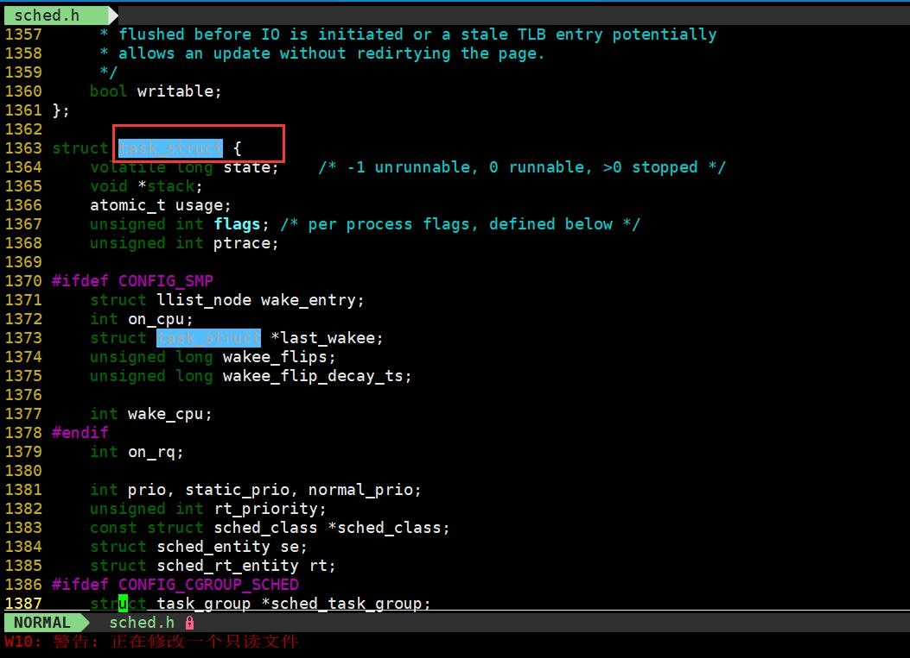
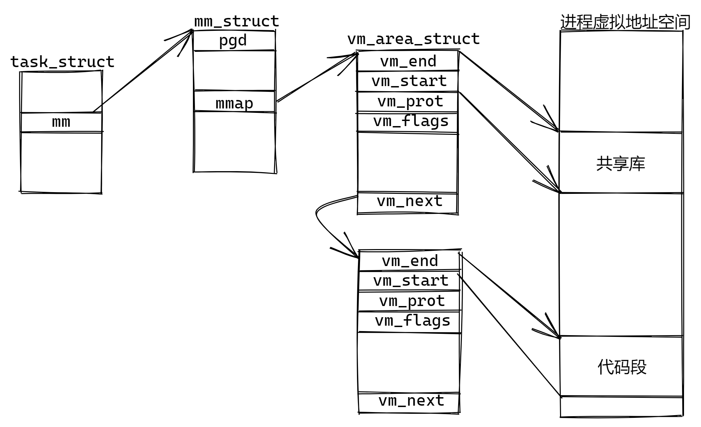
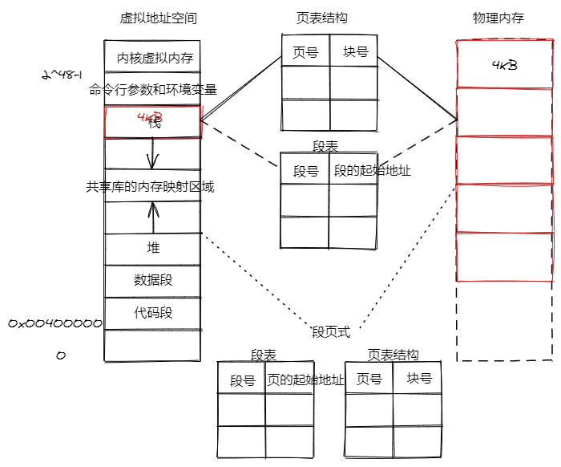
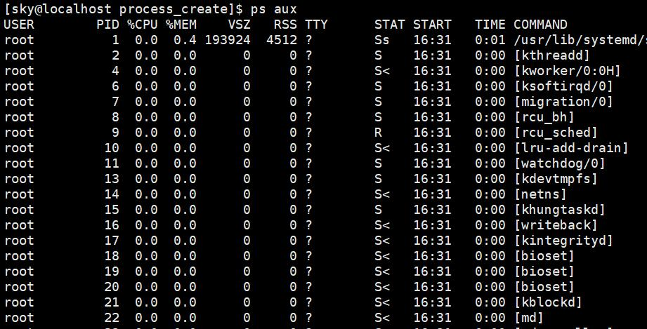
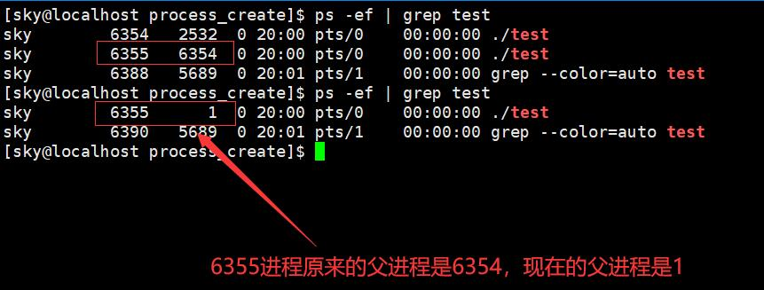
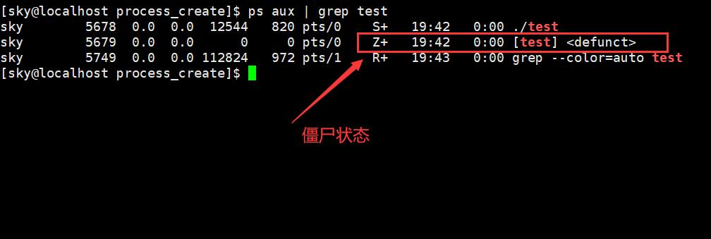
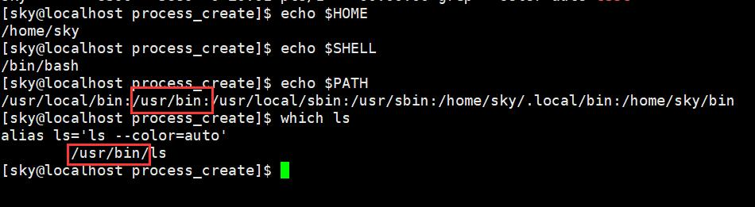

# 进程概念

**进程是什么？**

进程是一个程序执行的实例或者一个正在运行的程序，从linux内核角度分析，是在内核中创建了一个task_struct结构体来描述进程，该结构体中比较重要的有：进程PID(描述本进程的唯一标识)、进程状态(运行、睡眠、停止、僵尸)、内存指针(指向进程的虚拟地址空间)、程序计数器(报存程序将要执行的下一条指令的地址)等，所以称进程是操作系统分配资源的基本单位。

- **cpu密集型程序**：程序大量的时间都在用CPU进行计算；
- **IO密集型程序**：程序大量的时间都在和磁盘打交道；
- **并行**：在同一时间，多个进程，每一个进程都拥有一个cpu进行计算；

- **并发**：多个进程，只有少量的cpu，每个进程只能独占cpu一小会，就会让出cpu供其他进程运算；

## 进程和程序

- 程序：(program)是存放在磁盘文件中的可执行文件；

- 进程：(process)是正在执行的(动态的)程序，占用系统资源，在内存中执行。

- 进程和程序的区别：
  - 程序是静态的，进程是动态的；
  - 程序一般保存在磁盘中，不占用系统资源，进程会占用系统资源
  - 一个程序可以对应多个进程，一个进程可以执行一个或多个程序
  - 进程具有并发性，而程序没有
  - 程序没有生命周期，进程有生命周期

## 进程控制块(PCB)

每个进程在内核中都有一个**进程控制块(PCB，process control block)**来维护进程的相关信息，Linux内核的进程控制块是**task_struct结构体**。

查看task_struct结构体：**/usr/src/kernels/3.10.0-1160.6.1.el7.x86_64/include/linux**，其中3.10.0-1160.6.1.el7.x86_64是版本信息，不同版本有所不同。



task_struct中主要内容：

1. 进程标识符：进程id，系统中每一个程序都有唯一的一个id(非负整数)
2. 状态：运行、就绪、阻塞，表示进程的运行状态
   - linux下对进程状态进行了再划分：
   - R(Running)运行状态：进程运行中或者进程在运行队列当中
   - S(Sleep)睡眠状态：可中断睡眠
   - D(Disk Sleep)磁盘休眠状态：不可中断睡眠
   - T(stopped)停止状态：可以通过发送SIGSTOP信号让进程处于停止状态，被暂停的进程通过发送SIGCONT信号继续运行
     - ctrl+z——使得一个进程成为暂停状态
     - kill -9 [pid]——杀死一个暂停状态的进程
   - t(trace stop)跟踪状态：gdb 调试的时候，进程处于跟踪状态
   - X死亡状态：这个状态是返回状态，在任务列表中不能看到
3. 优先级：相对于其他进程的优先级
4. 程序计数器：程序中即将被执行的下一条指令的地址
5. 内存指针：指向程序的虚拟地址空间

**内核使用双向链表来组织进程的task_struct信息。**

当一个程序启动，操作系统会维护一个task_struct结构体，并在**/proc/[pid]**文件夹保存与当前进程相关的文件。当进程运行的时候，这个文件会存在，当进程退出的时候，就会被操作系统所清理。

## 进程地址空间

### 进程虚拟地址空间



task_struct结构体中一个条目指向mm_struct，他描述了虚拟内存的当前状态，其中的两个字段，pgd指向第一级页表(页的全局目录)的基址，而mmap指向一个vm_area_struct的链表，其中每一个都描述了当前虚拟地址空间中的一个区域，这个结构主要包含的字段：区域的起始处、区域的结束处、这个区域内包含的所有页的读写权限、这个区域内的页面是。与其他进程共享的还是这个进程私有的、链表中下一个区域结构。

#### 写时拷贝机制：

当fork函数被当前进程调用时，内核为新进程创建各种数据结构，并分配给它一个唯一的PID。为了给这个新进程创建虚拟内存，它创建了当前进程的mm_struct、区域结构和页表的原样副本。他将两个进程中的每个页面都标记为只读，并将两个进程中的每个区域结构都标记为私有的写时拷贝。当fork在新进程中返回时，新进程现在的虚拟内存刚好和调用fork时存在的虚拟内存相同。当这两个进程中的任意一个后来进行写操作时，写时拷贝机制就会创建新页面。

### 物理内存和虚拟空间映射



1. 分页式管理
   - 操作系统创建一个虚拟地址空间，作为进程可以引用的地址集合，以32位系统为例是2^32=4GB，这个地址空间被分割成一个个的页面(page)，常见大小4KB。
   - 页表结构：页号和块号
   - 虚拟地址=页号+页内偏移，页号=虚拟地址/块大小，页内偏移=虚拟地址%块大小，块的起始地址=块号*块大小，物理地址=块的起始地址+业内偏移
2. 分段式管理
   - 虚拟地址=段号+段内偏移，物理地址=段的起始地址+段内偏移
   - 段表结构：段号和段内偏移地址
3. 段页式管理
   - 虚拟地址=段号+页号+页内偏移
   - 通过段号找到页的起始地址；通过页的起始地址，找到对应的页表结构；通过页号，在页表中找到对应的块号；通过块号乘以大小找到块的起始地址；块的起始地址加上页内偏移，找到具体的物理地址。

## 进程常用命令

#### kill

- 给进程发送一个信号
- SIGKILL 9号信号
- kill -9 pid ——杀死进程

#### ps

进程状态查看：**ps -aux / ps -ajxf** 



- PID ——当前进程id
- PGID ——组进程id
- SID ——会话id
- TTY ——登录者终端机的位置（与中断无关用？显示）
  - 一般liunx允许有7个终端，可以用ctrl+alt+fn来切换，n是要切换的终端号
- STAT ——进程状态字段
  - D(Disk sleep)磁盘休眠状态(不可中断休眠)
  - R(running)运行状态
  - S(sleeping)睡眠状态(可中断睡眠)
  - T(stopped)停止状态
  - X死亡状态(dead)
  - Z(zombie)僵尸状态
  - < 高优先级
  - N 低优先级
  - L 有页面在内存中被锁存
  - s 进程领导者，表示其有子进程
  - l 多线程
  - +位于前台进程组

## 孤儿进程

一个父进程退出，而它的一个或者多个子进程还在运行，那那些子进程将成为**孤儿进程**。Linux系统中，每当出现一个孤儿进程，内核就会把孤儿进程的父进程设置为init，而init进程会循环的调用wait()，处理已经退出的子进程。

举个栗子：

```cpp
#include <stdio.h>
#include <unistd.h>
int main()
{
    pid_t pid=fork();
    if(pid<0)
    {   
        perror("fork error");
        return 0;
    }   
    else if(pid==0)
    {   
        printf("我是子进程，进程id=%d,父进程id=%d\n",getpid(),getppid());                                        
        //子进程
        while(1)
        {   
            sleep(1);
        }   
    }   
    else
        //父进程
        printf("我是父进程，进程id=%d\n",getpid());
        sleep(20);
    }
    return 0;
}
```



子进程一直在运行，通过ctrl+z 和ctrl+c 无法杀死，通过kill [pid]杀死进程。

## 僵尸进程

一个进程使用fork创建子进程，如果子进程先退出，而父进程并没有调用wait或者waitpid获取子进程的状态信息，那么子进程的进程仍然保存在系统中。

子进程已经退出了，但是它的父进程还没有回收其资源(PCB)，从而导致子进程变成僵尸状态(由于子进程的PCB并没有给内核所释放，释放这样的PCB需要父进程来进行回收)，那么这个进程就称为**僵尸进程**。 

### 举个栗子：

```cpp
#include <stdio.h>                                                               #include <unistd.h>
int main()
{
    pid_t pid=fork();
    if(pid<0)
    {
        perror("fork error");
        return 0;
    }
    else if(pid==0)
    {
        //子进程逻辑
        printf("我是子进程，进程id=%d,父进程id=%d\n",getpid(),getppid());
        sleep(2);
        printf("子进程退出\n");
    }
    else
    {
        //父进程逻辑
        //防止父进程先结束，产生孤儿进程
        while(1)
        {
            printf("我是父进程，进程id=%d\n",getpid());
            sleep(1);
        }
    }
    return 0;
}
```



### 危害

对于僵尸进程，如果进程不调用wait/waitpid的话，那么保留的那段信息就不会释放，其进程号就会一直被占用，但是系统所能使用的进程号是有限的，如果产生大量僵尸进程，将因为没有可用的进程号而导致系统不能产生新的进程。

### 解决方法

僵尸进程并不是问题的根源，罪魁祸首是产出大量僵尸进程的那个父进程。因此，当我们要消灭僵尸进程时，要做的就是把产生僵尸进程的父进程杀死(通过发送SIGTERM或者SIGKILL信号)，杀死父进程之后，产生的僵尸进程就变成了孤儿进程，这些孤儿进程会被init进程接管。

## 环境变量

环境变量是指在操作系统中用来指定操作系统运行环境的一些参数。

### 常见环境变量

- HOME:保存当前用户主目录的路径

- SHELL:保存当前使用的命令行解释器的名称,它的值通常是/bin/bash  

- PATH:保存可执行程序的路径

- LD_LIBRARY_PATH:程序运行时，依赖库文件的搜索路径

- CPLUS_INCLUDE_PATH:可以定义第三方C++头文件所在的路径

  

  举个例子：之所我们能在任意路径下使用ls命令，是因为环境变量PATH下包含了可执行程序ls所在的路径。

### 相关命令

1. 查看全局环境变量
   - env
2. 查看单个环境变量
   - echo $name  //name是环境变量名称
3. export——更改或者增加环境变量
   - export [环境变量名称]=$[环境变量名称]:[新加的环境变量的值]
   - 临时生效，在命令行中进行操作；永久生效，需要更改文件内容
   - 系统环境变量 /etc/bashrc，当前用户环境变量 ~/.bashrc(~/.bash_profile，在文件中加入环境变量后，执行source ~/.bash_prifile，会重新加载环境变量文件(重新打开一个终端，也会重新加载环境变量文件)，让刚才的更改生效)

#### 代码中获取环境变量

1. main函数的参数

   - ```cpp
     int main(int argc,char* argv[],char* env[])
     //argc——命令行参数个数
     //argv——命令行参数
     //env——环境变量
     ```

2. libc库当中的变量来获取

   - ```cpp
     extern char** environ
     ```

3. getenv函数

   - ```
     #include <stdlib.h>
     char *getenv(const char *name);
     ```

   getenv()用来取得参数name环境变量的内容

   name：环境变量的名称

   返回值：执行成功则返回指向该内容的指针，找不到符合的环境变量名称则返回NULL


