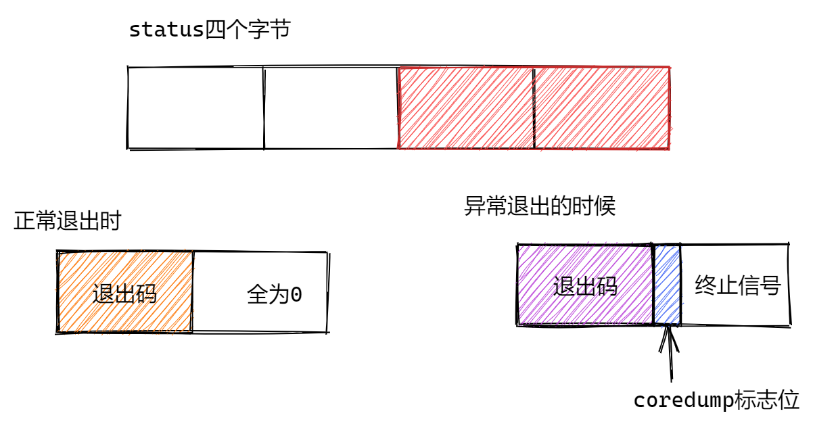

# 进程控制

## 进程创建

### fork函数

fork函数：创建一个新进程

```
#include <unistd.h>
pid_t fork(void);
```

返回值：

- 成功时，父进程返回子进程id，子进程返回0
- 失败时，返回-1

注意：不是fork函数能返回两个值，而是fork后，fork函数变为两个，父子各需要返回一个。fork函数是一个**系统调用函数**。

### getpid/getppid函数

```
#include <sys/type.h>
#include <unistd.h>
//获得当前进程的id
pid_t getpid(void);
//获得父进程的id
pid_t getppid(void);
```

举个栗子：

```c
#include <stdio.h>
#include <unistd.h>
int main()
{
    int x=1;
    pid_t pid=fork();
    if(pid<0)
    {   
        perror("fork fail");
        return 0;
    }   
    else if(pid==0)
    {   
        //Child
        x++;
        printf("I am child process,id is %d,my father id is %d,x=%d\n",getpid(),getppid(),x);
    }   
    else if(pid>0)
    {   
        x--;
    printf("I am father process,id is %d,my father id is %d,x=%d\n",getpid(),getppid(),x);
    }   

    //睡眠一下
    while(1)                                                                                                                                                                
    {   
        sleep(1);
    }   
    return 0;
}
```


fork()函数创建子进程，子进程得到与父进程虚拟地址空间相同的一份副本，包括代码段、数据段、堆、共享库以及用户栈。子进程还获得与父进程任何打开文件描述符相同的副本。当fork函数在第六行返回时，本地变量x在父进程和子进程中都为1，然而，父进程和子进程都是独立的进程，都有自己的私有地址空间，后面父进程和子进程对x做的操作都是独立的，因此运行结果在父进程中是0，子进程中是1。

### vfork()函数

```
#include <sys/types.h>
#include <unistd.h>
pid_t vfork(void);
```

vfork()创建出来的子进程拷贝部分父进程的PCB，子进程和父进程共同用一个虚拟地址空间，这样就会出现调用栈混乱的问题，vfork的解决方案：先让子进程执行，父进程等待子进程执行完毕之后再执行。

## 进程终止

一个进程在终止时会关闭所有的文件描述符，释放用户空间分配的内存，但它的PCB还保留着，内核在其中保留了一些信息：

- 如果是正常退出，则保存着退出状态
- 如果是异常退出，则保存着导致该进程终止的信号是哪个

这个进程的父进程可以调用wait或waitpid获取这些信息，然后彻底清除掉这个进程。

在shell中用 **echo $? 获取进程的退出码**，因为shell是它的父进程，当它终止时 shell调用wait或waitpid得到它的退出状态。

### 正常终止

1. 从main函数中，return退出

   执行return n等同于执行exit(n)，因为调用main的运行时函数会将main的返回值当做exit的参数。

2. 调用exit：库函数

   ```
   #include <stdlib.h>
   void exit(int status);
   ```

3. _exit：系统调用

   ```
   #include <unistd.h>
   void _exit(int status);
   ```

**exit最后也会调用_exit**，但是在调用之前还做其他工作：

1. 执行用户通过atexit或者on_exit定义的清理函数

   - ```cpp
     int atexit(void(*funcation)(void));
     //参数一个函数指针，可以接受没有返回值，没有参数的函数地址
     //作用：调用atexit,将参数传入的函数地址告诉内核。当程序需要退出的时候，才调用传入的地址，这样的函数叫回调函数。
     ```

2. 关闭所有打开的流，所有的缓存数据均被写入  

3. 调用_exit

刷新缓冲区：

- 从main函数的return返回可以刷新缓冲区
- \n也会刷新缓冲区
- 调用exit也会刷新缓冲区
- fflush(stdout);可以强制刷新缓冲区

缓冲区是C库维护的，并不是内核维护的，如果直接调用_exit函数，直接执行了内核代码，不会刷新缓冲区。

### 异常退出

ctrl+c，信号终止

## 进程等待

进程等待就是为了防止僵尸进程的产生。

### wait函数

作用：

1. 阻塞等待，如果子进程没结束，会陷入阻塞，直到子进程结束
2. 回收子进程残留资源
3. 获取子进程结束状态(退出原因)

```
#include<sys/types.h>
#include<sys/wait.h>
pid_t wait(int* status);
```

- status是一个传出参数，供调用者获取子进程的退出状态

  - status的四个字节，只用到了后面的两个字节
  - 正常退出的时候，高8位是退出码，低八位全为0
  - 异常退出的是时候，高8位是退出码，低八位中1位为coredump标志位，剩下7为终止信号

  

  - 判断程序是否正常退出，**status&0x7f**(判断低7位中是否有某个比特位1)，等于0表示正常退出
  - 判断是否有coredump产生，**(status>>7)&0x1**，等于0 则表示没有coredump产生
  - 获取退出码，**(status>>8)&0xff**

- 返回值
  - 成功，返回子进程的pid
  - 失败，返回-1
  
- 阻塞：当调用函数需要等待一定条件成熟的时候，才可以返回；条件一直不成熟，则一直等待

调用wait会导致父进程陷入阻塞状态，直到有一个子进程退出，则执行wait的逻辑之后退出

### waitpid

作用同wait，但可以指定pid进程清理，可以不阻塞

```
#include<sys/types.h>
#include<sys/wait.h>
pid_ t waitpid(pid_t pid, int *status, int options);
```

- 返回值
  - 如果设置了WNOHANG，那么没有子进程退出，则返回0，如果有子进程退出，则返回退出的pid
  - 失败，返回-1(没有子进程)
- 参数
  - pid：
    - pid==-1，等待任意一个子进程退出
    - pid>0，等待进程id为pid的进程退出
    - pid< -1，回收一组进程
  - status：退出的子进程的退出状态
    - WIFEXITED(status): 若为正常终止子进程返回的状态，则为真。（查看进程是否是正常退出）
    - WEXITSTATUS(status): 若WIFEXITED非零，提取子进程退出码。（查看进程的退出码）
  - options：设置当前的waitpid是阻塞的还是非阻塞的
    - WNOHANG：如果当前等待的子进程没有退出，会立刻返回，执行后面的逻辑，非阻塞一般搭配循环使用，如果没有等待到子进程退出，则循环调用waitpid
    - 0：与wait函数相同，产生阻塞
  - 子进程死亡原因
    - 正常死亡WIFEXITED
      - 如果WIFEXITED 为真，使用WEXITSTATUS得到退出状态
    - 非正常死亡WIFSIGNALED
      - 如果WIFSIGNALED为真，使用WTERMSIG得到信号

## 进程程序替换

当进程调用一种exec函数时,该进程的用户空间的代码段和数据段完全被新程序替换,从新程序的启动历程开始执行。调用exec并不创建新进程,所以调用exec前后该进程的id并未改变。  

### 原理

通过进程PCB当中的内存指针，找到进程虚拟地址空间当中的数据段和代码段，通过页表映射将数据段和代码段映射到新的程序的物理内存上，直白一点，使用新的程序将之前进程的数据段和代码段进行更新。

### exec函数

头文件：#include  <unistd.h>

返回值：只有失败的时候才有返回值，返回-1

- **int execl(const char *path, const char *arg, …);**
  - path：带路径的可执行程序 (ls /usr/bin/ls)
  - arg：给可执行程序传递的参数，**第一个参数是可执行程序的名称**
  - …：可变参数列表，以NULL结尾
- **int execlp(const char *file, const char *arg, …)**
  - file：可执行程序的名称
  - arg：给可执行程序传递的参数，**第一个参数是可执行程序的名称**
  - …：可变参数列表，以NULL结尾
- int execle(const char *path, const char *arg, ...,char *const envp[]);
  - path：带路径的可执行程序
  - arg：给可执行程序传递的参数，以NULL结尾
  - envp：程序员自己组织环境变量，如果不传入则认为当前进程没有环境变量
- int execv(const char *path, char *const argv[]);
  - path：带v路径的可执行程序 (ls /usr/bin/ls)
  - argv：给可执行程序传递的参数，**第一个参数是可执行程序的名称**，以NULL结尾
- int execvp(const char *file, char *const argv[]);  
  - file：可执行程序的名称
  - argv：给可执行程序传递的参数，**第一个参数是可执行程序的名称**，以NULL结尾v
- int execve(const char *filename, char *const argv[], char *const envp[]);
  - filename：可执行程序的名称
  - argv：给可执行程序传递的参数，**第一个参数是可执行程序的名称**，以NULL结尾
  - envp：程序员自己组织环境变量，如果不传入则认为当前进程没有环境变量

举个栗子：

```
#include <unistd.h>
int main()
{
	char *const argv[] = {"ps", "-ef", NULL};
	char *const envp[] = {"PATH=/bin:/usr/bin",
	"TERM=console", NULL};
	
	execl("/bin/ps", "ps", "-ef", NULL);
	
	// 带p的，可以使用环境变量PATH，无需写全路径
	execlp("ps", "ps", "-ef", NULL);

	// 带e的，需要自己组装环境变量
	execle("ps", "ps", "-ef", NULL, envp);
	
	execv("/bin/ps", argv);

	// 带p的，可以使用环境变量PATH，无需写全路径
	execvp("ps", argv);

	// 带e的，需要自己组装环境变量	
	execve("/bin/ps", argv, envp);
	
	exit(0);
}
```

exec函数簇都是库函数，最终都是调用函数int execve(const char* filename, const char* argv[], const char* envp[])

### 使用场景

1. 守护进程——服务24小时不间断运行
   - 基本具备的条件：server可执行程序，守护进程的程序
   - 守护进程是由守护进程启动的，在守护进程程序当中，使用到了创建子进程+进程程序替换+进程间通信
   - 守护进程程序创建子进程，子进程进程程序替换为server可执行程序，利用进程间通信，每隔一段时间获取一下子进程状态；**守护进程去获取进程状态，发现server可执行程序状态异常；执行策略就是重新创建子进程，让子进程进程程序替换，替换为新的server可执行程序**
   - server可执行程序，通过进程间通信的方式，每隔一段时间告诉父进程当前的状态
2. shell终端
   - 启动bash可执行程序
   - 当用户输入命令(可执行程序)的时候，创建子进程，子进程进程程序替换
   - 在子进程进行进程程序替换的时候，如果是前台进程，则bash负责进程等待

