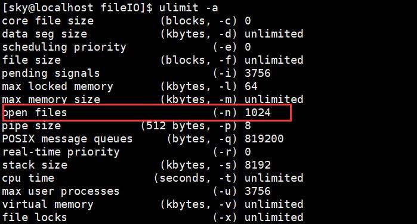
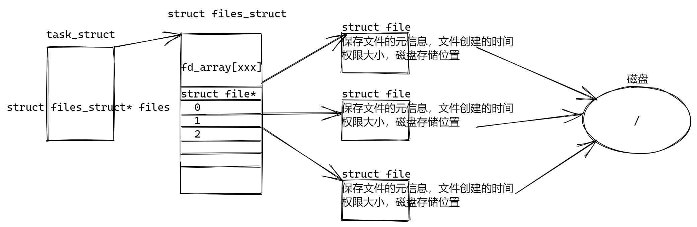
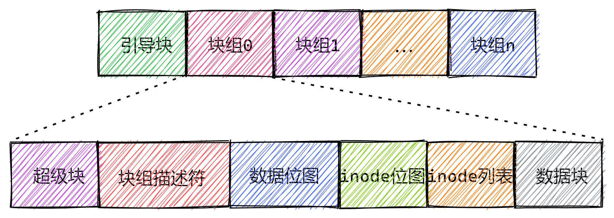

# 基础IO

I/O：input & output，是一切实现的基础。

- stdio标准IO
- sysio系统调用IO，又叫文件IO

## 标准IO

### fopen

fopen()函数——打开文件

```cpp
FILE* fopen(const char *path, const char *mode)
```

- 返回值：
  - 文件成功打开后，指向该流的文件指针就会被返回
  - 文件打开失败，则返回NULL，并把错误码存在erron中
- FILE：文件流指针类型
- path：要打开的文件路径及文件名，如果不带路径，则在当前的目录下寻找
- mode：代表文件流形式
  - r：以**读**方式打开，如果当前打开的文件不存在，则报错
  - r+：以**读写**方式打开，如果当前打开的文件不存在，则报错
  - w：以**写**的方式打开
    - 如果文件不存在，则创建该文件
    - 如果当前文件存在，则将当前**文件截断**(文件长度清零，即该文件内容会消失)，文件流指针指向文件头部
  - w+：以**读写**的方式打开
    - 如果文件不存在，则创建该文件
    - 如果当前文件存在，则将当前文件截断(文件长度清零，即该文件内容会消失)，文件流指针指向文件头部
  - a：以**追加方式**打开，**只写文件，并不能读文件**
    - 如果文件不存在则创建该文件
    - 如果当前文件存在，写入的数据会被追加到文件尾，即文件原先的内容会被保留
  - a+：以**追加方式**打开，**可读写文件**
    - 如果文件不存在则创建
    - 如果当前文件存在，写入的数据会被追加到文件尾，即文件原先的内容会被保留

### fread

fread()函数——从文件流读取数据

```cpp
size_t fread(void *ptr, size_t size, size_t nmemb, FILE *stream);
```

- ptr：将fread读到的内容保存在ptr里面
- size：块的大小，单位是字节	
- nmemd：块的个数
  - ​	size*nmemd==总的字节大小
- stream：文件流指针，从哪里读
- 返回值：返回成功读到的块的个数
- 常用的用法：将块的大小size指定为1，块的个数就是ptr内存空间大小

### fwrite

fwrite()函数——将数据写至文件流

```cpp
size_t fwrite(const void *ptr, size_t size, size_t nmemb,FILE *stream);
```

- ptr：写什么数据，写的内容保存在ptr里面
- size：写数据时块的大小	
- nmemd：块的个数，多少字节
- stream：文件流指针，写到哪里去
- 返回值：返回成功写入的块个数
- 常用的用法：将块的大小size指定为1，返回值就是成功写入的字节数量

### fseek

fseek()函数——移动文件流的读写位置

```cpp
int fseek(FILE *stream, long offset, int whence);
```

- 返回值：执行成功返回0，否则返回-1设置erron来表示错误
- stream：已打开的文件流指针
- offset：根据参数whence来移动读写位置的位移量
- wnence：需要将文件流指针定位到哪个位置
  - SEEK_SET 距文件开头offset位移量，为新的读写位置
  - SEEK_CUR 以目前的位置往后增加offset个位移量，为新的读写位置
  - SEEK_END 将读写位置指向文件尾后再增加offset个位移量
- 当whence值为SEEK_CUR或SEEK_END，允许offset出现负值的情况

### fclose

fclose()函数——关闭文件

```cpp
#include <stdio.h>
int fclose(FILE *stream);
```

- fclose()用来关闭先前fopen()打开的文件，此动作会让缓冲区内的数据写入文件中，并释放系统所提供的文件资源
- stream：已打开的文件指针
- 返回值：
  - 若文件关闭成功，则返回0
  - 若有错误发生，则返回EOF并把错误代码存在erron中

fopen、fclose、fread、fwrite是C标准库当中的函数，我们成为库函数。

库函数高层的，是在系统调用上的一层包装，运行在用户态，为程序员提供调用真正的在幕后完成实际事务的系统调用的更为方便的接口。

## 系统调用IO

### open

open()函数——打开或创建一个文件

```cpp
#include <sys/types.h>
#include <fcntl.h>
int open(const char* pathname,int flags);
int open(const char* pathname,int flags,mode_t mode);
```

- pathname：要打开或创建的文件名(包含目录，可以是相对路径也可以是绝对路径)
- flags：
  - 必选项，以下三个中必须选定一个，且仅允许指定一个
    - O_RDONLY：以只读方式打开文件
    - O_WRONLY：以只写方式打开文件
    - O_RDWR：以可读写方式打开文件
  - 下列的可用按位或(|)运算符连接起来
    - O_CREAT：若此文件不存在则创建它
    - O_TRUNC：如果文件已存在，并且以只写或可读写方式打开，则将其长度截断
    - O_APPEND：如果文件已有内容，这次打开文件所写的数据附加到文件的末尾而不覆盖原来的内容。  
- mode：设置文件的访问权限，可以直接给八进制的文件权限位
- 返回值：
  - 成功，返回新分配的文件描述符
  - 失败，返回-1并设置erron

由open返回的文件描述符一定是该进程尚未使用的最小描述符。  

### write

write()——向打开的设备或文件中写数据

```cpp
#include <unistd.h>
ssize_t write(int fd,const void* buf,size_t count);
```

write()会把参数buf所指的内存写入count个字节到参数fd所指的文件内

- fd：文件描述符
- buf：写入的数据
- count：写入数据的大小
- 返回值：
  - 若成功则返回实际写入的字节数
  - 若有错误发生则返回-1

### read

read()函数——从打开的设备或文件中读取数据

```cpp
#include <unistd.h>
ssize_t read(int fd,void* buf,size_t count);
```

read()会把参数所指的文件传送count个字节到buf所指的内存中

- fd：文件描述符
- buf：读上来的数据保存在哪里
- count：请求读取的字节数
- 返回值：
  - 若成功则返回实际写入的字节数
  - 若有错误发生则返回-1

### lseek

lseek()函数——移动文件的读写位置

每一个已打开的文件都有一个读写位置，当打开文件时通常其读写位置是指向文件开头，若是以附加的方式打开文件(O_APPEND)，则读写位置会指向文件尾。当调用read()和write()时，读写位置会随之改变，lseek()就是用来控制该文件的读写位置。

```cpp
#include <sys/types.h>
#include <unistd.h>
off_t lseek(int fildes,off_t offset,int whence);
```

- fildes：为已打开的文件描述符
- offset：根据参数whence来移动读写位置的位移量
- whence：
  - SEEK_SET 距文件开头offset位移量，为新的读写位置
  - SEEK_CUR 以目前的位置往后增加offset个位移量，为新的读写位置
  - SEEK_END 将读写位置指向文件尾后再增加offset个位移量
- 当whence值为SEEK_CUR或SEEK_END，允许offset出现负值的情况
- 返回值：
  - 当调用成功时则返回目前的读写位置，也就是距离文件开头多少个字节
  - 若有错误则返回-1，error会存放错误代码

### close

close()函数——关闭一个已打开的文件

```cpp
#include <unistd.h>
int close(int fd);
```

- fd：要关闭的文件描述符
- 返回值：
  - 若文件顺利关闭，则返回0
  - 发生错误，返回-1并设置erron

当一个进程终止时，内核对该进程所有尚未关闭的文件描述符调用close关闭，所以即使用户程序不调用close，在终止时内核也会自动关闭它打开的所有文件。  

open、close、read、write都属于系统提供的接口，称之为系统调用接口。

系统调用(system call)是操作系统内核态提供的函数，在内核态运行，是操作系统为用户提供的一些接口。


**标准IO**


## 文件描述符	



Linux进程默认情况下会有3个缺省打开的文件描述符，分别是标准输入0， 标准输出1， 标准错误2。（stdin、stdout、stderr）



文件描述符就是从0开始的正整数。当我们打开文件时，操作系统在内存中要创建相应的数据结构来描述目标文件，于是就有了file结构体，用来表示一个已经打开的文件对象。而进程执行open系统调用，所以必须让进程和文件关联起来。**每个进程都有一个结构体指针files, 指向一个files_struct结构体,该结构体最重要的部分就是包含一个指针数组，每个元素都是struct file结构体一个指向打开文件的指针。所以本质上，文件描述符就是该数组的下标。**只要拿着文件描述符，就可以找到对应的文件  。

文件描述符的分配规则：**在file_struct数组当中，找到当前没有被使用的最小的一个下标，作为新的文件描述符。**

文件描述符与文件流指针之间的关系：

文件流指针 typedef struct _IO_FILE FILE;（/usr/include/libio.h文件下的结构体）

```cpp
struct _IO_FILE{
	//读缓冲区
	char* _IO_read_ptr; //当前读到的位置
	char* _IO_read_end; //读缓冲区的结束位置
	char* _IO_read_base; //读缓冲区的起始位置
	//写缓冲区
	char* _IO_write_base;
	char* _IO_write_ptr;
	char* _IO_write_end;
    
    //用来保存文件描述符
    int _fileno;
};
```

## 重定向

重定向将一个文件描述符所对应fd_array数组当中的元素所指的struct file*的内容更改为另外一个文件信息，意味着当前文件描述符所对应的struct file指向的文件被另外一个文件替代了。

- ```cpp
  > 清空重定向,清空文件之间的内容，在重定向到文件中
  ```

- ```cpp
  >> 追加重定向，追加在文件之后
  ```

- ```cpp
  < 输出重定向
  ```

### dup2

```cpp
#include <unistd.h>
int dup2(int oldfd,int newfd);
```

- 返回值：
  - 成功返回新的文件描述符
  - 失败返回-1，error会存放错误代码

### dup

```cpp
#include <unistd.h>
int dup(int oldfd);
```

用来复制参数oldfd所指的文件描述符，并将它返回。此新的文件描述符和参数oldfd所指的是同一个文件，共享所有的锁定、读写位置和各项权限。

- 返回值：
  - 成功返回新的文件描述符
  - 失败返回-1，error会存放错误代码

## 静态库和动态库

windows环境下静态库的后缀是**.lib**，在windows环境下编译一个依赖库文件的库执行程序，编译阶段依赖静态库，程序运行阶段依赖的是动态库(**.dll**)

在Linux下会将编译的代码当中的所有函数全部编译到静态库当中去，静态库是一个库文件

静态链接指的是gcc或者g++的命令行参数，(-static)如果程序是静态链接产生的可执行程序，会将静态库当中的所有代码全部编译到可执行程序当中去，当程序执行的时候，是不需要依赖静态库的。

Linux下，静态库的后缀为**.a**，前缀为**lib**；

1. 静态库的生成与使用
   - 生成	ar -rc lib[库文件名称].a [xxx].o [xxxx].o
   - 生成静态库的时候，是使用.o文件来进行编译生成的
   - 使用的时候 -L [指定链接库文件的路径] -l[库文件名称]
2. 动态库的生成与使用
   - liunx下，动态库的后缀为 .so，前缀为lib
   - 生成  gcc/g++ -shared -fPIC  依赖的文件 -o 动态库名称
   - -shared：生成动态库的命令行参数
   - -FPIC：产生位置无关的代码
   - 使用的时候  -L [指定链接库文件的路径] -l[库文件名称]

## ext2文件系统



超级块：包含文件系统的信息(inode总个数、块总个数、每个块的inode个数、每个块组的块个数)

块组描述符：包含文件系统中各个块组的状态(块组中空闲块和inode的数目)

Block Bitmap: 描述Data blocks区域中哪一个块是空闲的，哪一个是使用的

inode Bitmap：描述inode结点在inode Table当中哪里是空闲的，哪里被使用

inode列表：描述文件在Data blocks区域当中都占用哪些块

```
使用命令ll -i 可以查看文件的inode结点号
```

1. 如何存储文件数据？
   - 将文件分成不同的block块，从Block Bitmap当中查找，Data blocks区域中空闲的块，将文件存储在不同的空闲块中
   - 需要对文件进行描述，从inode Table中查找空闲的inode结点，从inode Table中获取inode结点，使用inode结点去描述文件存储信息
   - 文件名称+inode结点号作为目录的目录项存储起来
2. 如何获取文件数据
   - 在目录当中根据文件名称和inode结点号，找到inode结点
   - 根据inode信息，查找到文件在Data blocks当中对应的块，将块组织起来，就获取到了文件信息、

## 软/硬链接

1. 软链接
   - 创建：ln -s [源文件] [创建出来软链接的名称]
   - 软链接相当于重新创建了一个文件，这个文件有**独立的inode结点**，但是文件内容是另外一个文件的路径。
   - 修改软链接文件或者源文件是一样的；
2.  硬链接
   - 创建：ln [源文件] [创建出来硬链接的名称]
   - 硬链接文件和源文件具有相同的inode结点信息