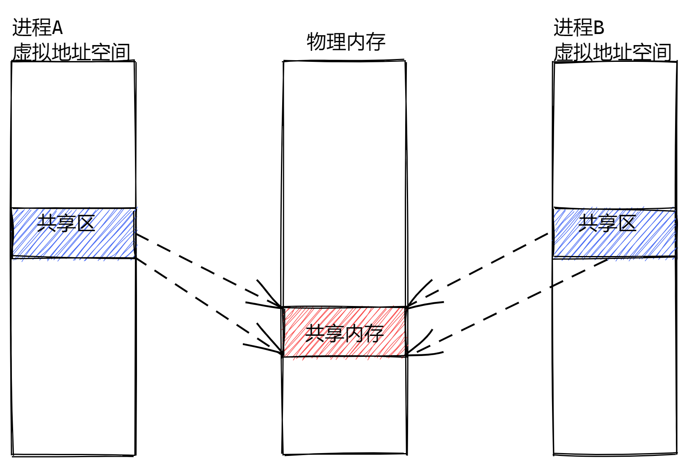
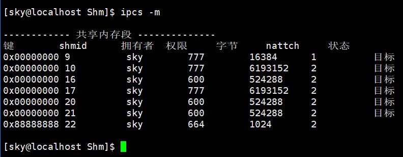

# 进程间通信

管道（数据传输）、共享内存（数据共享）、消息队列（数据传输）、信号量（进程控制）

**为什么需要进程间通信？**

- 每一个进程都是拥有自己的独立的虚拟地址空间和页表结构，促使了进程独立，导致了进程和进程之间相互协作的问题，为了解决这种问题，才产生了进程间通信。

**进程间通信种类的细分：**

- 数据传输
- 数据共享
- 进程控制

## 管道(pipe)

### 匿名管道 

- 我们把从一个进程连接到另一个进程的数据流称为一个管道；
- 需要通信的两个进程在管道的两端；
- 匿名管道就是内核当中的一块缓存；

### 特性

- 只能用于有亲缘关系的进程之间进行通信
- 是半双工的，数据只能在一个方向流动(从写端到读端)
- 提供字节流式服务  ——如果读端没有及时进行读的话，但是写端往进去写了，后面写的数据会追加在之前写的数据后面。数据其实都是二进制存储的，没有明确的数据边界，如果两次的数据表达的内容是不同的内容，有可能导致读端获取到数据之后，无法知道写端表达的是什么意思。
- 读端读数据的时候，是从管道当中将数据拿走了，并不是当前被读走的数据还存留在管道中。
- 生命周期随进程——进程退出，管道释放
- 内核会对管道操作进行同步和互斥
  - 临界资源：同一时间，当前的资源只能被一个进程所访问，由于不同的进程对临界资源访问的时候,不会
  - 同步：同一时间，保证只能有一个进程访问资源
  - 互斥：保证对临界资源访问的合理性
- PIPE_SIZE:65536字节，64K(匿名管道的大小)	PIPE_BUF:4K大小 ——保证写入数据或读取数据的原子性

  - 原子性：当前的操作不能被打断，运行的结果只能有两个，要么是操作完成(1)，要么是操作没有完成(0)

### 创建

**pipe()会建立管道，并将文件描述符由参数filedes数组返回**

```
#include <unistd.h>
int pipe(int filedes[2])
```

- filedes[2]是一个出参，也就是我们在使用该函数的时候，需要传入一个int类型大小为2的数组，在函数内部会将数组的值进行补充，调用完成后之后，就能拿到管道对应的读写端；数组中的每一个元素都是一个文件描述符
- filedes[0]为管道里的读取端，filedes[1]为管道里的写入端
- 返回值：若成功返回0，否则返回-1，错误原因存在errno中 

### 父子进程通信

1. 父进程调用pipe函数创建管道，得到两个文件描述符fd[0]、fd[1]指向管道的读端和写端。
2. 父进程调用fork创建子进程，那么子进程也有两个文件描述符指向同一管道。
3. 父进程关闭管道读端，子进程关闭管道写端。父进程可以向管道中写入数据，子进程将管道中的数据读出。由于管道是利用环形队列实现的，数据从写端流入管道，从读端流出，这样就实现了进程间通信。

### 读写规则

- 读管道
  - 管道中有数据，read返回实际读到的字节数
  - 管道中无数据：
    - 管道写端被全部关闭，read返回0 (比如读到文件结尾)
    - 写端没有全部被关闭，read阻塞等待(等待写端往管道写入数据，此时会让出cpu)
- 写管道
  - 管道读端全部被关闭， 进程异常终止(也可使用捕捉SIGPIPE信号，使进程不终止)
  - 管道读端没有全部关闭：
    -  管道已满，write阻塞等待(等待读端读走管道中的数据)
    - 管道未满，write将数据写入，并返回实际写入的字节数

## 命名管道(FIFO)

命名管道是具有标识符的管道，内核当中开辟的内存是有标识的，不同的进程可以通过名字访问到命名管道；

要在不相关的进程之间交换数据，可以使用FIFO文件，又称命名管道。

### 创建

**使用命令创建命名管道**

- mkfifo [命名管道的文件名称]
- 文件类型是p(管道文件)

**mkfifo()函数创建命名管道**

```
#include <sys/stat.h>
#include <sys/types.h>
int mkfifo(const char* pathname,mode_t mode);
```

- mode：指定创建出来的命名管道的读写权限
- mkfifo()会依参数pathname()建立特殊的FIFO文件，该文件必须不存在
- 返回值：若成功返回0，若出错则返回-1

可以通过操作命名管道来对内核当中命名管道的内存区域进行读写操作

### 特性

- 具有标识符，可以满足不同进程之间的进程间通信
- 生命周期是跟随进程的

## 共享内存

### 原理



拿出虚拟地址空间中的一块内存来，映射到相同的物理内存中，共享内存使得多个进程可以访问同一块内存空间。

1. 现在物理内存当中开辟一段空间
2. 各个进程通过页表结构将物理内存映射到自己的虚拟地址空间当中的共享区
3. 各个进程之间的通信是通过修改自己虚拟地址空间当中的共享区的地址来完成的

### 特性

- 不同进程对共享内存区域进行读的时候，并不会抹除物理内存当中的值
- 共享内存的生命周期是跟随操作系统内核的
- 共享内存没有进行同步和互斥

### 创建

**创建共享内存**

```cpp
#include <sys/shm.h>
#include <sys/ipc.h>
int shmget(key_t key,size_t size,int flag);
```

- key：共享内存的标识符
- size：共享内存的大小(字节)，通常为系统页长的整数倍
- flag：
  - IPC_CREAT: 如果想获取的共享内存不存在，则创建共享内存，如果存在则返回共享内存操作句柄
  - IPC_EXCL | IPC_CREAT : 如果想获取的共享内存存在，则报错
- 返回值
  - 成功时，返回一个有效的共享内存标识符
  - 出现错误时，返回-1，错误原因存在errno中

**将进程附加到共享内存上**

```cpp
#include <sys/types.h>
#include <sys/shm.h>
void* shmat(int shmid,const void* shmaddr,int shmflg);
```

shmat()将由shmid标识的System V共享内存段连接到调用进程的地址空间。

- shmid：共享内存的标识符
- shmaddr：
  - 一般将shmaddr设为NULL，系统将选择一个合适的(未使用的)地址来指定内存映射到哪一个地址上。
- shmflg：
  - 0:可读可写
  - IPC_RDONLY:只读
- 返回值：返回共享内存映射到哪一个地址上

**从共享内存当中分离进程**

```cpp
#include <sys/types.h>
#include <sys/shm.h>
int shmdt(const void* shmaddr);
```

- shmaddr：共享区当中映射的物理内存的首地址，之前shmat的返回值

**共享内存的销毁**

```cpp
#include <sys/ipc.h>
#include <sys/shm.h>
int shmctl(int shmid,int cmd,struct_ds* buf);
```

shmctl()在shmid中给出标识符的System V共享内存段上执行cmd指定的控制操作

- shmid:共享内存的标识符
- cmd：想让shmctl函数做什么操作
  - IPC_STAT:获取共享内存的状态
  - IPC_RMID: 删除共享内存，标记共享内存为删除状态
- buf：作为一个出参，用来获取共享内存状态信息，传入一个struct_ds结构体对象的地址

### 查看共享内存



- ipcs -m

- ipcrm -m [shmid]	——删除共享内存

如果删除了一个有进程附加的共享内存，操作系统的做法是：

1. 先标记当前的共享内存为destory状态，并且将key设置为0x00000000，表示当前的共享内存不能再被其他进程所附加，同时会释放共享内存
2. 带来的风险，导致正在附加到该共享内存上的进程有崩溃的风险，一般禁止删除有进程附加的共享内存
3. 当进程退出的时候，操作系统就会将描述共享内存的结构体也释放掉

## 消息队列

### 原理

消息队列是保存在内核中的消息链表，存放在内核中并由消息队列标识符标识。在消息队列中每个元素都有自己的类型，类型之间有一个优先级的概念。

在发送数据时，会分成一个一个独立的数据单元，也就是消息体，消息体时用户自定义的数据类型，消息的发送方和接收方要约定好消息体的数据类型，所以每个消息体都是固定大小的存储块（克服管道是无格式的字节流），**如果进程从消息队列中堆区了消息体，内核就会吧这个消息体删除。**

### 特性

- 可发送最长消息的字节数：8K
- 有一个特定队列的最大字节数：16384
- 消息队列的生命周期跟随内核
- 消息队列可以进行双工通信
- 克服了管道的无格式字节流的缺点

### 创建

**打开或创建一个队列**

```
#include <sys/types.h>
#include <sys/ipc.h>
#include <sys/msg.h>
int msgget(key_t key, int msgflg);
```

- 返回值：若成功返回消息队列的标识符，出错返回-1
- key:消息队列的标识
- msgflg:
  - PC_CREAT: 如果想获取的不存在，则创建，如果存在则返回操作句柄
  - IPC_EXCL | IPC_CREAT : 如果想获取的存在，则报错

**将数据放到消息队列中**

```
#include <sys/types.h>
#include <sys/ipc.h>
#include <sys/msg.h>
int msgsnd(int msqid, const void *msgp, size_t msgsz, int msgflg);
```

- msgid:消息队列的标识符
- msgp:发送的数据
- msgsz:数据的长度
- msgflg:
  - 0:当队列满了，则阻塞
  - IPC_NOWAIT:如果说队列满了，则当前发送的操作不会进行阻塞，函数返回
- 返回值：若成功返回0，若出错返回-1

**从消息队列中获取消息**

```
#include <sys/types.h>
#include <sys/ipc.h>
#include <sys/msg.h>
ssize_t msgrcv(int msqid, void *msgp, size_t msgsz, long msgtyp,int msgflg);
```

- msgtyp:
  - ==0：则返回队列当中的第一个消息
  - msgtype>0：则返回队列当中消息类型为msgtyp的第一个消息
  - msgtype<0：则返回队列当中消息类型小于等于msgtyp绝对值的消息，如果这样的消息比较多，则返回类型最小的那个消息
- 返回值：若成功返回消息队列的部分数据长度没若出错则返回-1

## 信号量

### 原理

信号量是一个整型的计数器，主要用于实现进程间的互斥与同步，而不是用于缓存进程通信的数据。

信号量本质是一个计数器+PCB等待队列，用于多进程对共享数据对象的访问，实现了同步与互斥。

### 工作机制

信号量表示资源的数量，控制信号量的操作方式：

- P操作，把信号量减去1，相减后如果信号量<0，则表明资源已被占用，进程需要阻塞等待；相减后如果>=0，则表明还有资源可以使用，进程可正常继续执行。
- V操作，把信号量加上1，相加之后如果信号量<=0，则表明当前有阻塞中的进程，于是会将该进程唤醒；相加之后如果>0，则表明当前没有阻塞中的进程。


