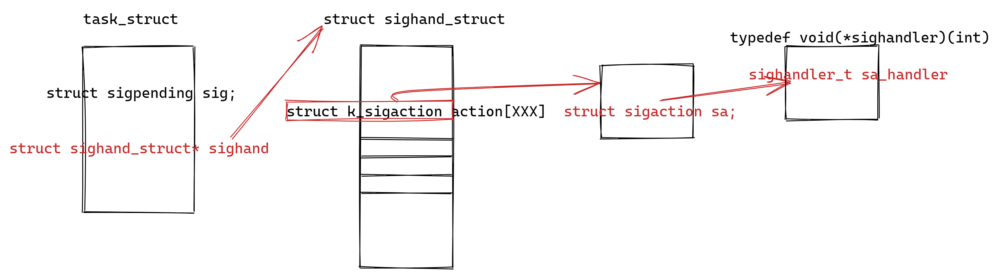

# 进程信号

信号是一个软件中断，打断当前的正在运行的进程，让该进程去处理信号的事件。

## 信号的种类

使用**kill -l**命令查看信号


Linux操作系统中，总共有62种信号

- 前1－31，不可靠信号，信号有可能会丢失，非实时信号
- 后34－64，可靠信号，信号不可能被丢失的，实时信号，它们没有固定的含义（可以由用户自定义）。所有的实时信号的默认动作都为终止进程。

## 信号的生命周期

### 产生

- 硬件产生

  - Ctrl + C：给前台发送一个SIGINT(2)信号，中断当前的前台进程(停止一个已失去控制的程序)
    - 把一个进程放到后台去运行，在启动命令之后加&
    - fg，把刚放到后台的进程，放到前台来
  - Ctrl + Z：给前台发送一个SIGTSTP(20)信号，使当前进程暂停
  - Ctrl + |：给前台发送一个SIGQUIT(3)信号，退出进程同时产生一个core文件

- 命令产生

  - kill -[信号标识] [进程ID]：给进程发送某个信号
  - eg: kill -9 [pid]给进程发送SIGKILL信号，用来立即结束该进程

- 函数产生

  - kill函数：给指定进程发送指定信号

    - ```cpp
      #include <sys/types.h>
      #include <signal.h>
      int kill(pid_t pid, int sig);
      ```

    - pid>0：发送信号给指定的进程

    - pid=0：将信号传给和目前进程相同组的所有进程

    - pid=-1：将信号广播传送给系统内所有的进程

    - pid<0：取pid的绝对值发送给对应的进程组

    - sig：要发送什么信号

    - 返回值：执行成功返回0，如果有错误则返回-1

  - abort函数：
  
    - ```cpp
      #include <stdlib.h>
    void abort(void);
      ```

    - 给自己发送异常终止信号SIGABRT，终止并产生core文件

  - alarm函数：
  
    - ```cpp
      #include <unistd.h>
    unsigned int alarm(unsigned int seconds);
      ```
  
    - 给自己发送SIGALRM信号
  
  - raise函数：
  
    - ```cpp
      #include <signal.h>
      int raise(int sig);
      ```
  
    - 给当前进程发送指定信号

**解引用空指针/越界，产生11号信号SIGSEGV(段错误)**

### 注册


**前提：**

1、在内核当中的task_struct结构体当中，保存一个struct sigpenging 的对象sig(未决信号集合，就是信号产生了还没有决定怎么做)，struct sigpenging这个结构体当中保存了两个元素：

```
struct sigpending{
	struct list_head list;
	sigset_t signal;
}
```

sigset_t类型也是一个结构体，struct sigset_t保存了一个unsigned  long sig[xxx] ——>sig这个数组是按照比特位来使用的，我们称为位图。

2、内核当中还维护了一个队列，队列当中的每一个元素对应信号的一个处理节点。

**信号的注册分两种：**

- 非可靠信号：1~31
  - 当程序收到一个信号时，操作系统会给当前程序维护的sig位图当中对应的比特位更改为1，并且在sigqueue队列当中增加对应信号的节点；
  - 当多次收到同样的一个信号时(判断多次收到同样信号的标准就是判断sig位图中的比特位)，只添加一次节点，也就是意味着第二次(多次)收到的同样的信号就被丢弃了。
- 可靠信号：34~64
  - 当程序收到一个信号时，操作系统会给当前程序维护的sig位图当中对应的比特位为1，并且在sigqueue队列当中增加对应信号的节点；
  - 当多次收到同样的一个信号时，多次添加对应信号的节点到sigqueue队列当中去，也就是意味着，每一个信号操作系统在处理信号的时候都会从sigqueue队列拿出对应的节点进行处理，也就是信号没有丢失。

### 注销

在信号处理之前，会先销毁信号的信息；信号注销存在的目的就是为了抹除信号存在的痕迹，防止对同一个信号进行多次处理。

- 非可靠信号

  将sig位图当中对应信号的比特位从1置为0，并且将该信号的sigqueue节点从sigqueue队列中去除掉

- 可靠信号

  从sigqueue队列当中获取待处理信号对应的节点，并且**判断sigqueue队列当中是否还有对应相同信号的节点**；
  
  如果有，去除sigqueue队列当中刚才拿出来的对应信号的节点，不会将sig位图中的比特位置为0；
  
  如果没有，去除sigqueue队列当中对应信号的节点，并且将sig位图置为0

### 捕捉处理

**执行默认动作**

- SIG_DEL——>执行一个操作系统定义好的动作（操作系统执行了一个函数）

**忽略(丢弃)**

- SIG_IGN——>操作系统不会干任何事情
- 僵尸进程：子进程退出的时候，给父进程发送了一个SIGCHID信号，但是操作系统对SIGCHID信号的处理方式为忽略处理，而导致父进程不去处理信号，从而子进程变成僵尸进程

**自定义处理**

自定义处理：程序员自己定义信号的处理函数

signal(设置信号处理方式)

- ```cpp
  #inlclude <signal.h>
  sighandler_t signal(int signum,sighandler_t handler);
  ```

- signum：需要更改自定义处理函数的信号

- handler：接收一个函数的地址，将信号的处理函数更改为什么函数

  - typedef void (*sighandler)(int);
  - int：参数，指的是哪一个信号触发操作系统调用该函数

- 我们注册的函数，被称为回调函数，并不是我们调用signal函数的时候，回调函数就会被操作系统调用执行，而是当我们收到自定义信号的时候，操作系统才会帮我们调用该函数，进行处理信号。

- 回调函数的执行是操作系统的执行流调用执行的。

- **自定义信号的处理流程**

  

  - 在task_struct结构体当中，有一个指向sighand_struct的结构体，在该结构体中有一个action数组，数组当中的每一个元素都是一个struct k_sigation结构体，数组当中的每一个元素对应一个信号的处理逻辑
  - 在struct k_sigation结构体当中有一个元素是struct sigaction sa，在struct sigaction结构体中有一个sighandler_t类型的元素，这个sighandler_t是一个函数指针类型，typedef void(*handler)(int)，保存信号默认执行的函数

sigaction

- ```cpp
  #include <signal.h>
  int sigaction(int signum, const struct sigaction *act,struct sigaction *oldact);
  ```

  - signum：需要更改的信号

  - ```cpp
    struct sigaction {
        void (*sa_handler)(int);//操作系统为每一个信号定义的默认调用函数
        void (*sa_sigaction)(int, siginfo_t *, void *);//这个函数指针一般是预留的，配合sa_flags使用，当sa_flags为SA_SIGINFO的时候，操作系统就会调用该函数指针当中保存的函数地址
        sigset_t sa_mask;//表示当前进程在处理信号的时候，也可能会收到新的信号，将新的信号放在sa_mask中
        int sa_flags;
        void (*sa_restorer)(void);//预留信息
    };
    ```

  - act：表示把signum信号修改为act处理方式

  - oldact：表示的是操作系统之前被signum所定义的处理方式

  - struct sigaction相当于action[]数组中元素的类型

- sigaction函数相当于更改掉了action数组当中的元素，也就是直接更改结构体达到修改信号处理函数地址的目的

```cpp
int sigmptyset(sigset_t* set);
//将位图的所有比特位设置为1
```

## 信号的捕捉流程


举个栗子：

```cpp
int main()
{
	signal(2,sigcallback);
	while(1)
	{
		sleep(1);
	}
}
```

1. 当收到ctrl+c，也就是2号信号的时候
2. 当程序执行sleep函数的时候，从用户态切换到内核态，执行内核代码
3. 执行完sleep的逻辑之后，需要调用do_signal函数，处理程序所收到的信号
   1. 当程序没有收到2号信号，直接调用sys_return 函数返回到用户态
   2. 程序收到了2号信号，切换到用户态去执行用户自定义的函数
4. 执行完毕之后，调用sig_return函数切换回内核态，再次调用do_signal函数，重复逻辑3，直到程序收到的信号被处理完
5. 调用sys_return函数返回用户态继续执行代码

## 信号的阻塞

信号的阻塞就是阻止一个信号的抵达，当一种信号被阻塞时，它仍然可以被发送，但是产生的待处理信号不会被接受，直到进程取消对这种信号的阻塞。

在PCB中有一个阻塞信号集合(block位图，实现方式与pending相同)，凡是添加到这个集合中的信号，都表示需要阻塞，暂时不需要处理。

sigprocmask()函数显式地阻塞和取消阻塞选择的信号

```cpp
#include <signal.h>
int sigprocmask(int how ,const sigset_t *set,sigset_t *oldset);
```

- how：告诉函数应该做什么操作
  - SIG_BLOCK：设置某个信号为阻塞状态，用修改位图到达目的 block(new)=block(old)|set
  - SIG_UNBLOCK：设置某个信号为非阻塞状态，block(new)=block(old)& (~set)
  - SIG_SETMASK：block(new)=set，替换阻塞位图
- set：要设置的新的阻塞位图
- oldset：之前程序当中阻塞的位图

**在所有的信号中，有两个信号(9号) SIGKILL和（19号)SIGSTOP，不可被阻塞，不可被自定义修改处理方式，也不可被忽略。**

## 可重入和不可重入

竞态条件：多个执行流访问同一个资源的情况下，会对程序结果产生二义性的结果，称为竞态条件。

重入：多个执行流访问到同一个资源。

可重入：多个执行流访问同一个资源，不会对程序结果产生影响；

重入：多个执行流访问同一个资源，会产生一个二义性的结果；


