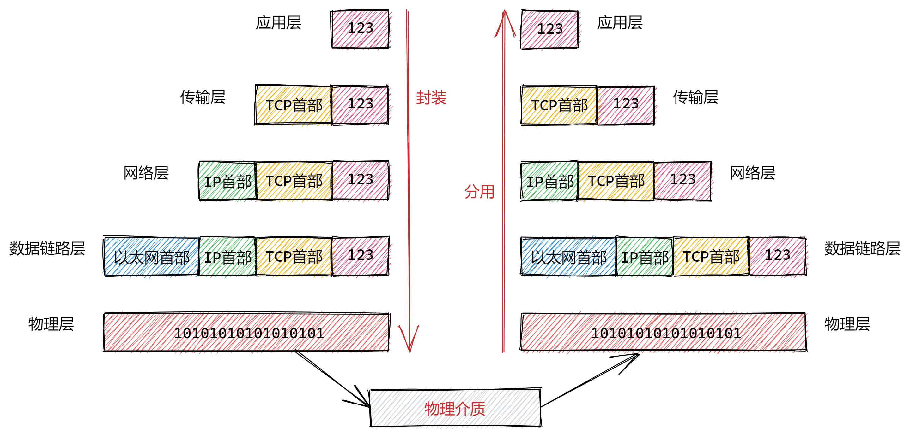

# 网络基础

- 按照网络覆盖范围划分为：局域网、城域网、广域网

## 协议

- 协议是指通信双方约定使用同一种解析信息的手段来进行有效的沟通
- **网络协议**：计算机网络中，通信双方对进行数据交换和数据传输而建立的规则、标准或者做出的约定，指定一个通信协议标准
- 计算机当中有很多不同的网络协议，将一系列的协议称之为**协议簇**
- 参考模型：定义各个协议之间的关系，并且划分了每个协议需要完成的任务

## 协议分层模型

1. OSI参考模型(自下而上)：物理层、数据链路层、网络层、传输层、会话层、表示层、应用层
   1. 表示层：将设备固有的数据格式转换为网络标准传输格式
   2. 会话层：利用传输层提供的服务建立和维护会话
2. TCP/IP五层模型：物理层、数据链路层、网络层、传输层、应用层
3. 应用层：负责应用程序之间的数据沟通，为操作系统或网络应用程序提供访问网络服务的接口
   1. http协议、FTP协议(文件传送协议)、SSH协议()、DNS协议(域名解析协议)、SMTP协议(邮件传送协议)
4. 传输层：负责将上层数据分段并提供端到端的、可靠或者不可靠的数据传输
   1. TCP协议(传输控制协议)、UDP协议(用户数据报协议)
5. 网络层：负责地址管理和路由选择
   1. IP协议(因特网互联协议)、ICMP协议(因特网控制报文协议)、路由器
6. 数据链路层：负责相邻设备之间的数据帧传输
   1. 以太网协议、交换机
7. 物理层：负责光电信号传输
   1. 中继器、集线器

**将不同层次所经历的网络协议的集合称之为协议栈**

## 网络传输的封装与分用



假设主机A和主机B进行通信，主机A想要向主机B发送一个数据包

1. 主机A打开一个聊天窗口输入123，并进行发送，应用层对发送的数据包进行处理，包括字符编码、格式化等等
2. 假设在传输层使用TCP协议，TCP会在应用层的数据的前端附加一个TCP首部字段，TCP首部包含了源端口和目的端口，表明数据包从哪里发出的，需要发送到哪里去；TCP首部还包含校验和，用于判断数据是否损坏；随后将TCP头部附加在数据包的首部发送给网络层
3. 网络层主要负责处理数据包的是IP协议，IP协议在TCP传过来数据的前端加上自己的IP首部；IP首部包含目的地址和源地址，还有用来判断是TCP还是UDP的信息；IP包生成后，会由路由控制表判断但应该发送至哪一个主机
4. 在数据链路层经由IP传过来的数据包，以太网协议会给数据包附上以太网首部，以太网首部包含接收端和发送端的MAC地址，以及标志以太网类型的以太网数据协议等
5. 物理层将数据链路层传过来的数据包，转变成01的二进制光电信号，通过物理介质发送给主机B

数据包的接收流程是发送流程的逆序

1. 目的主机接收到数据包之后，首先会从以太网的首部找到MAC地址，判断是否是发送给自己的数据包，如果不是发送给自己的数据包则会丢弃该数据包；如果是发送给自己的，就会查找以太网类型时那种协议，交给哪种协议处理
2. 经过以太网处理后的数据包交给网络层，假设我们使用的IP协议，收到数据包之后就会解析IP首部，判断IP首部中的IP地址是否和自己的IP地址一致，如果匹配则接收数据判断上一层是UDP还是TCP协议；如果不匹配则直接扔掉
3. 在传输层，假设使用了TCP协议，首先会计算校验和，判断数据是否损坏；然后见擦汗是否按照序号接收数据，最后检查端口号，确定是发送给哪个应用程序，数据被识别完毕之后，会传递给由端口号识别的应用程序
4. 接收端指定的应用程序会处理发送方传递过来的数据，通过解码等操作识别出数据的内容

## 网络应用程序设计模式

- C/S模式
  - 客户机(client)/服务器(server)模式，需要在通讯两端各自部署客户机和服务器来完成数据通信
- B/S模式
  - 浏览器/服务器模式，只需在一端部署服务器，而另一端使用每台PC都默认配置的浏览器即可完成数据的传输

## IP地址

- 作用：在网络当中唯一标识一台主机
- 本质：无符号32位整型，4个字节
  - 192.168.113.192——>点分十进制表示法
  - 点分法每一个字节最大能够表示的数字是255
- 源IP地址和目的IP地址
  - 网络通信当中，每一条数据都是需要具备5个信息，我们成为5元组(源IP+源端口+目的IP+目的端口+protocol)
  - 源IP：src_ip——>标识数据从哪里来
  - 目的IP：dest_ip——>表示数据往哪里去
  - 源端口：src_port
  - 目的端口：dest_port
  - networking protocol：网络协议
- ipv6
  - ipv4和ipv4指的是不同版本的IP协议
  - 并且ipv6并不向下兼容ipv4
  - ipv6——>16字节整数

## port

- 作用：端口是在一台主机当中标识一个进程
- 本质：无符号16位整数，范围0~2^16(65535)；
  - 其中0~1023是知名端口
  - ssh——侦听端口22
  - http——侦听端口80
  - mysql——侦听端口3306
  - oracle——侦听端口1521
- 使用
  - 网络当中的程序，通信的时候，都是需要使用端口进行通信的
  - 客户端：主动发起请求的一方，称之为客户端
  - 服务端：被动的固定在同一个位置上接收请求的一方，称之为服务端

## 网络字节序

- 字节序：CPU对内存当中的数据进行存取的顺序
  - 大端字节序：低地址存高位
  - 小段字节序：低地址存低位

- 网络字节序都是大端字节序
  - 小段机器和大端机器进行网络通信的时候，如果不转换字节序，则会造成小端机器很小的数字，经过网络传输，被大端机器读出来变成一个大的数字
- 主机字节序：当前机器的字节序
- 字节序转换
  - 小端字节序转化成网络字节序
  - h——host、n——network、l——long 32位长整形、s——short 16位短整型

- ```cpp
  uint32_t htonl(uint32_t hostlog);
  ```

  - 将32位的主机字节序转换为网络字节序

- ```cpp
  uint32_t ntohl(uint32_t netlog);
  ```

  - 将32位的网络字节序转换为主机字节序

- ```cpp
  uint16_t htons(uint16_t hostshort);
  ```

  - 将16位的主机字节序转换为网络字节序

- ```cpp
  uint16_t ntohs(uint16_t netshort);
  ```

  - 将16位的网络字节序转换为主机字节序