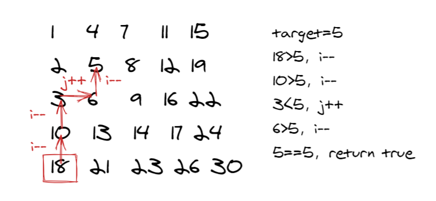

# 剑指offer04.二维数组中的查找

## 题目描述

在一个 n * m 的二维数组中，每一行都按照从左到右递增的顺序排序，每一列都按照从上到下递增的顺序排序。请完成一个函数，输入这样的一个二维数组和一个整数，判断数组中是否含有该整数。

 示例:

现有矩阵 matrix 如下：

[
  [1,   4,  7, 11, 15],
  [2,   5,  8, 12, 19],
  [3,   6,  9, 16, 22],
  [10, 13, 14, 17, 24],
  [18, 21, 23, 26, 30]
]
给定 target = 5，返回 true。

给定 target = 20，返回 false。

来源：力扣（LeetCode）
链接：https://leetcode-cn.com/problems/er-wei-shu-zu-zhong-de-cha-zhao-lcof

## 解题思路



- 从二维数组的左下角开始寻找，初始化行标i=matrix.size()-1，列标j=0
- 如果matrix\[i][j]>target，则在上一行寻找
- 如果matrix\[i][j]<target，则在下一列寻找
- 如果matrix\[i][j]=target，则返回true
- 遍历整个数组都未找到，则说明target不在数组中，返回false

## 代码实现

```cpp
class Solution {
public:
    bool findNumberIn2DArray(vector<vector<int>>& matrix, int target) {
        //判断若二维数组为空则返回
        if(matrix.size()==0)
        {
            return false;
        }
        //从二维数组的左下角开始查找
        int i=matrix.size()-1,j=0;
        //循环终止条件行标0<=i<matrix.size()-1
        while(i>=0&&j<matrix[0].size())
        {
            //如果matriax大于target则在上一行寻找
            if(matrix[i][j]>target)
            {
                i--;
            }
            //小于target则在下一列寻找
            else if(matrix[i][j]<target)
            {
                j++;
            }
            else 
                return true;
        }
        return false;
    }
};
```

