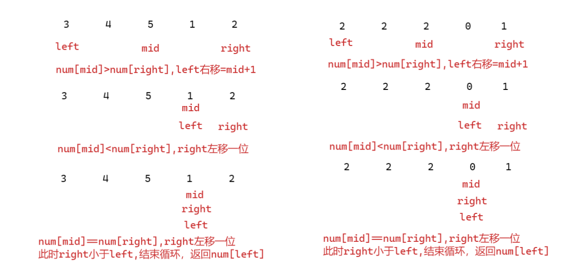

# 剑指offer11.数组的最小数字

## 题目描述

把一个数组最开始的若干个元素搬到数组的末尾，我们称之为数组的旋转。输入一个递增排序的数组的一个旋转，输出旋转数组的最小元素。例如，数组 [3,4,5,1,2] 为 [1,2,3,4,5] 的一个旋转，该数组的最小值为1。  

示例 1：

输入：[3,4,5,1,2]
输出：1
示例 2：

输入：[2,2,2,0,1]
输出：0

来源：力扣（LeetCode）
链接：https://leetcode-cn.com/problems/xuan-zhuan-shu-zu-de-zui-xiao-shu-zi-lcof
著作权归领扣网络所有。商业转载请联系官方授权，非商业转载请注明出处。

## 解题思路



- 数组旋转后分成了左右两个有序数组，实际找的是右边有序数组的最小值；
- 二分法查找，如果中间值大于最右边的值，说明分割点在右边，left向右移动；
- 如果中间值小于等于最右边的值，至少说明了当前右边的right值不是最小，需要right向左移动继续寻找；

## 代码实现

```cpp
class Solution {
public:
    int minArray(vector<int>& numbers) {
        if(numbers.size()==0)
        {
            return 0;
        }
        int left=0;
        int right=numbers.size()-1;
        while(left<right)
        {
            int mid=left+(right-left)/2;
            if(numbers[mid]>numbers[right])
            {
                left=mid+1;;
            }
            else if(numbers[mid]<=numbers[right])
            {
                right=right-1;
            }
        }
        return numbers[left];
    }
};
```

