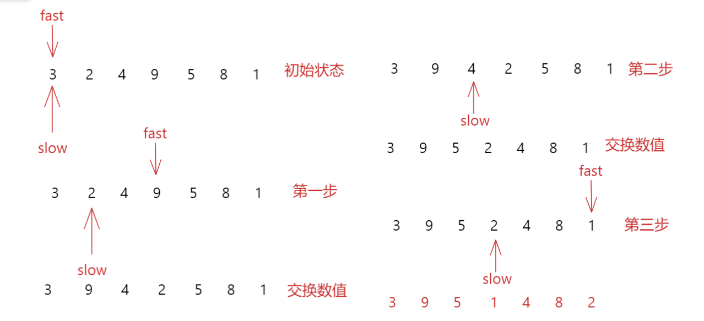

# 剑指offer21.调整数组顺序使奇数位于偶数前面

## 题目描述

输入一个整数数组，实现一个函数来调整该数组中数字的顺序，使得所有奇数位于数组的前半部分，所有偶数位于数组的后半部分。

示例：

输入：nums = [1,2,3,4]
输出：[1,3,2,4] 
注：[3,1,2,4] 也是正确的答案之一。

来源：力扣（LeetCode）
链接：https://leetcode-cn.com/problems/diao-zheng-shu-zu-shun-xu-shi-qi-shu-wei-yu-ou-shu-qian-mian-lcof

## 解题思路

- 快慢指针求解
- 使用两个指针，一个快指针fast，一个慢指针slow，从数组下标0开始
- 慢指针slow存放下一个奇数应该存放的位置，快指针fast往前遍历搜索奇数，搜索到之后就和slow指向的值交换



## 代码实现

```cpp
class Solution {
public:
    vector<int> exchange(vector<int>& nums) {
        int slow=0,fast=0;
        while(fast<nums.size())
        {
            if(nums[fast]&1==1)
            {
                if(slow!=fast)
                {
                    swap(nums[slow],nums[fast]);
                }
                slow++;
            }
            fast++;
        }
        return nums;
    }
};
```

