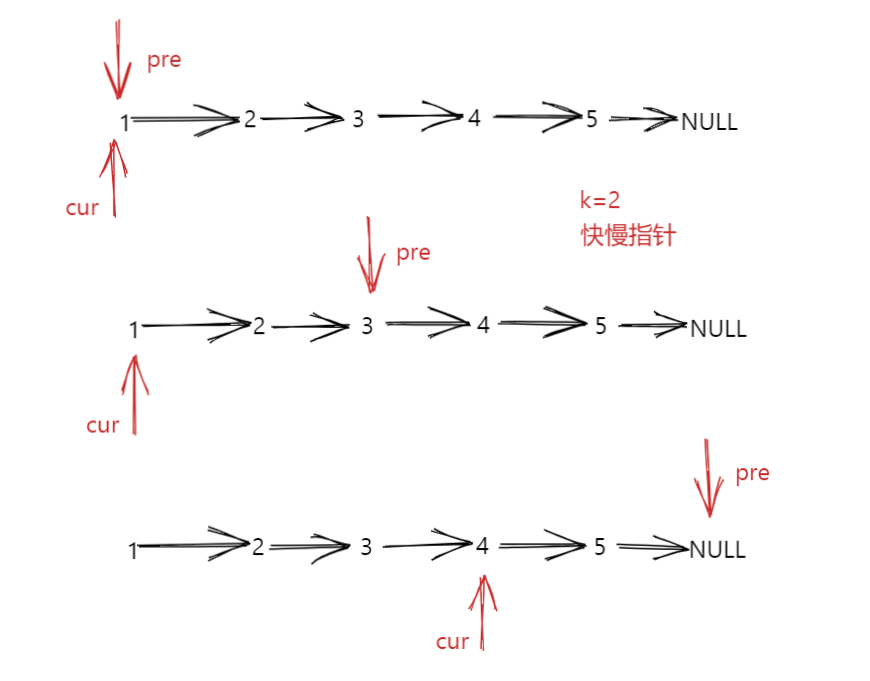

# 剑指offer22.链表中倒数第K个节点

## 题目描述

输入一个链表，输出该链表中倒数第k个节点。为了符合大多数人的习惯，本题从1开始计数，即链表的尾节点是倒数第1个节点。例如，一个链表有6个节点，从头节点开始，它们的值依次是1、2、3、4、5、6。这个链表的倒数第3个节点是值为4的节点。

示例：

给定一个链表: 1->2->3->4->5, 和 k = 2.

返回链表 4->5.

来源：力扣（LeetCode）
链接：https://leetcode-cn.com/problems/lian-biao-zhong-dao-shu-di-kge-jie-dian-lcof

## 解题思路



- 快慢指针法，使用两个指针pre和cur，pre指针先移动k步，然后cur指针和pre指针同时移动，当pre到链表末尾的时候，返回cur指针

## 代码实现

```cpp
class Solution {
public:
    ListNode* getKthFromEnd(ListNode* head, int k) {
        //定义两个指针
        ListNode* pre=head;
        ListNode* cur=head;
        //让pre指针先走K步
        for(int i=0;i<k;++i)
        {
            pre=pre->next;
        }
        //pre和cur指针一起走，直到pre指针为空
        while(pre!=NULL)
        {
            cur=cur->next;
            pre=pre->next;
        }
        return cur;
    }
};
```

