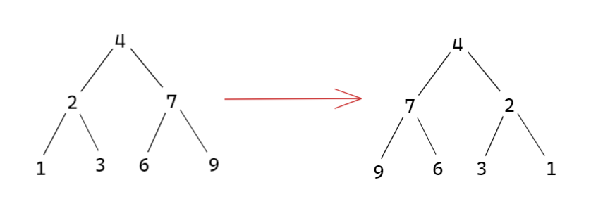

# 剑指offer27.二叉树的镜像

## 题目描述

请完成一个函数，输入一个二叉树，该函数输出它的镜像。

例如：



示例 1：

输入：root = [4,2,7,1,3,6,9]
输出：[4,7,2,9,6,3,1]

来源：力扣（LeetCode）
链接：https://leetcode-cn.com/problems/er-cha-shu-de-jing-xiang-lcof

## 解题思路

- 递归法解决(前序遍历/后续遍历)

  1. 确定递归的参数和返回值

     参数和返回值都是题目中函数给定的

  2. 递归终止条件

     当前节点为空的时候，就返回

  3. 单层递归的逻辑

     先序遍历，先交换左右孩子节点，然后反转左子树，反转右子树

  .png)

- 迭代法(利用栈实现)——深度优先遍历

## 代码实现

```cpp
//递归法
class Solution {
public:
    TreeNode* mirrorTree(TreeNode* root) {
        if(root==NULL)
        {
            return NULL;
        }
        swap(root->left,root->right);
        mirrorTree(root->left);
        mirrorTree(root->right);
        return root;
    }
};
```

```
//迭代法
class Solution {
public:
    TreeNode* mirrorTree(TreeNode* root) {
        if(root==NULL)
        {
            return NULL;
        }
        stack<TreeNode*> st;
        st.push(root);
        while(!st.empty())
        {
            TreeNode* node=st.top();
            st.pop();
            swap(node->left,node->right);
            if(node->left)
            {
                st.push(node->left);
            }
            if(node->right)
            {
                st.push(node->right);
            }
        }
        return root;
    }
};
```

