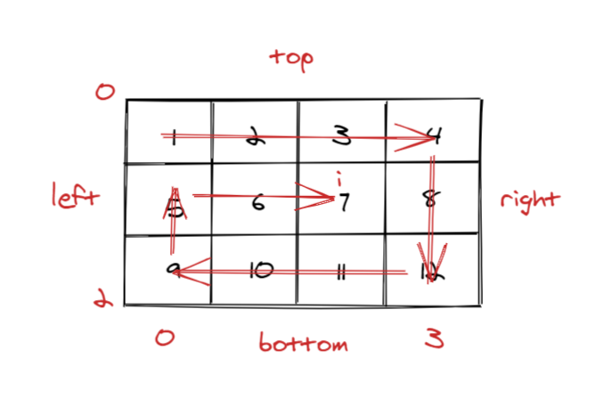

# 剑指offer29.顺时针打印数组

## 题目描述

输入一个矩阵，按照从外向里以顺时针的顺序依次打印出每一个数字。

示例 1：

输入：matrix = [[1,2,3],[4,5,6],[7,8,9]]
输出：[1,2,3,6,9,8,7,4,5]
示例 2：

输入：matrix = [[1,2,3,4],[5,6,7,8],[9,10,11,12]]
输出：[1,2,3,4,8,12,11,10,9,5,6,7]

来源：力扣（LeetCode）
链接：https://leetcode-cn.com/problems/shun-shi-zhen-da-yin-ju-zhen-lcof

## 解题思路



- 模拟顺时针输出，每次都输出一圈
- 设矩阵的上下左右分别为top、bottom、left、right
- left->right，上侧从左至右，遍历这一行，top++和下边界判断是否越界
- top->bottom，右侧从上至下，遍历这一列，right--和左边界判断是否越界
- right->left，下侧从右至左，遍历这一行，bottom--和上边界判断是否越界
- bottom->top，左侧从下至上，遍历这一列，left++和右边界判断是否越界

## 代码实现

```cpp
class Solution {
public:
    vector<int> spiralOrder(vector<vector<int>>& matrix) {
        //判空
        if(matrix.empty()||matrix[0].size()==0)
        {
            return {};
        }
        vector<int> ret;
        //上
        int top=0;
        //下
        int bottom=matrix.size()-1;
        //左
        int left=0;
        //右
        int right=matrix[0].size()-1;
        while(true)
        {
            //从左到右输出一行
            for(int i=left;i<=right;++i)
            {
                ret.push_back(matrix[top][i]);
            }
            //判断是否越界
            if(++top>bottom)
            {
                break;
            }
            //从上往下输出一列
            for(int i=top;i<=bottom;++i)
            {
                ret.push_back(matrix[i][right]);
            }
            if(--right<left)
            {
                break;
            }
            //从右向左输出一行
            for(int i=right;i>=left;--i)
            {
                ret.push_back(matrix[bottom][i]);
            }
            if(--bottom<top)
            {
                break;
            }
            //从下向上输出一列
            for(int i=bottom;i>=top;--i)
            {
                ret.push_back(matrix[i][left]);
            }
            if(++left>right)
            {
                break;
            }
        }
        return ret;
    }
};
```

