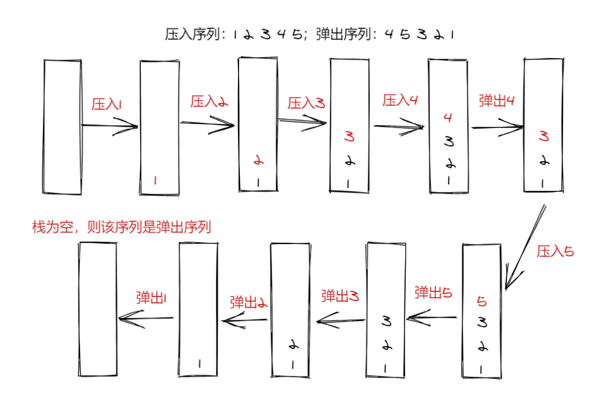

# 剑指offer31.栈的压入、弹出序列

## 题目要求

输入两个整数序列，第一个序列表示栈的压入顺序，请判断第二个序列是否为该栈的弹出顺序。假设压入栈的所有数字均不相等。例如，序列 {1,2,3,4,5} 是某栈的压栈序列，序列 {4,5,3,2,1} 是该压栈序列对应的一个弹出序列，但 {4,3,5,1,2} 就不可能是该压栈序列的弹出序列。

示例 1：

输入：pushed = [1,2,3,4,5], popped = [4,5,3,2,1]
输出：true
解释：我们可以按以下顺序执行：
push(1), push(2), push(3), push(4), pop() -> 4,
push(5), pop() -> 5, pop() -> 3, pop() -> 2, pop() -> 1
示例 2：

输入：pushed = [1,2,3,4,5], popped = [4,3,5,1,2]
输出：false
解释：1 不能在 2 之前弹出。

来源：力扣（LeetCode）
链接：https://leetcode-cn.com/problems/zhan-de-ya-ru-dan-chu-xu-lie-lcof

## 解题思路

- 使用一个辅助栈模拟栈的压入和弹出，按照压入序列的顺序依次压入栈，并按照弹出序列依次弹出；
  - 如果弹出序列的下一个弹出的数字刚好是栈顶数字，那么直接弹出
  - 如果下一个弹出的数字不在栈顶，把压入序列中还没有压入的数字压入栈，知道把下一个要弹出的数字压入为止
  - 如果所有的数字都压入了栈，还没有找到下一个弹出的数字，则该序列不可能是弹出序列



## 代码实现

```cpp
class Solution {
public:
    bool validateStackSequences(vector<int>& pushed, vector<int>& popped) {
        //用栈模拟进出
        stack<int> st;
        //压入队列的下标
        int i=0;
        //弹出序列的下标
        int j=0;
        while(i<pushed.size())
        {
            st.push(pushed[i]);
            i++;

            while(!st.empty()&&st.top()==popped[j])
            {
                st.pop();
                j++;
            }
        }
        return st.empty();
    }
};
```

