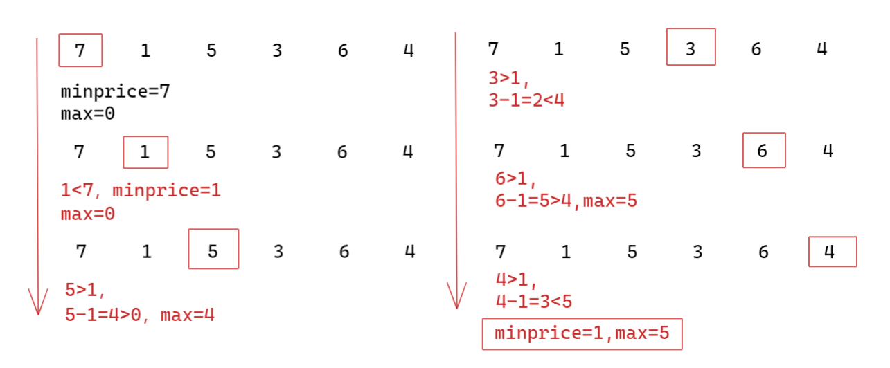

# 剑指offer63.股票的最大利润

## 题目描述

假设把某股票的价格按照时间先后顺序存储在数组中，请问买卖该股票一次可能获得的最大利润是多少？

 示例 1:

输入: [7,1,5,3,6,4]
输出: 5
解释: 在第 2 天（股票价格 = 1）的时候买入，在第 5 天（股票价格 = 6）的时候卖出，最大利润 = 6-1 = 5 。
     注意利润不能是 7-1 = 6, 因为卖出价格需要大于买入价格。
示例 2:

输入: [7,6,4,3,1]
输出: 0
解释: 在这种情况下, 没有交易完成, 所以最大利润为 0。

来源：力扣（LeetCode）
链接：https://leetcode-cn.com/problems/gu-piao-de-zui-da-li-run-lcof

## 解题思路

- 从数组的第2个元素开始把每个元素都假设成卖出点，找到对应的最佳买入点，逐一计算差值，就可得到最大利润：

  1. 把数组的第一个元素当做是临时的最低价格，最大利润为0
  2. 遍历第2个元素，1<7则当前最低价格为1，最大利润为0
  3. 遍历第3个元素，5>1当前最低价格还是1，假设5为卖出点，5-1=4>0则最大利润为4
  4. 遍历第4个元素，3>1当前最低价格还是1，假设3为卖出点，3-1=2<4最大利润还是4
  5. 遍历第5个元素，6>1当前最低价格还是1，假设6为卖出点，6-1=5>4则最大利润为5
  6. 遍历第6个元素，4>1当前最低价格还是1，假设4为卖出点，4-1=3<5则最大利润还是5

  

## 代码实现

```cpp
class Solution {
public:
    int maxProfit(vector<int>& prices) {
        //数组为空，返回0
        if(prices.empty())
        {
            return 0;
        }
        //初始化最低价格为第一个元素，最大利润为0
        int minprices=prices[0];
        int max=0;
        //从第二个元素开始遍历，假定为卖出点计算最大利润
        for(int i=1;i<prices.size();++i)
        {
            if(prices[i]<minprices)
            {
                minprices=prices[i];
            }
            else if(prices[i]-minprices>max)
            {
                max=prices[i]-minprices;
            }
        }
        return max;
    }
};
```


